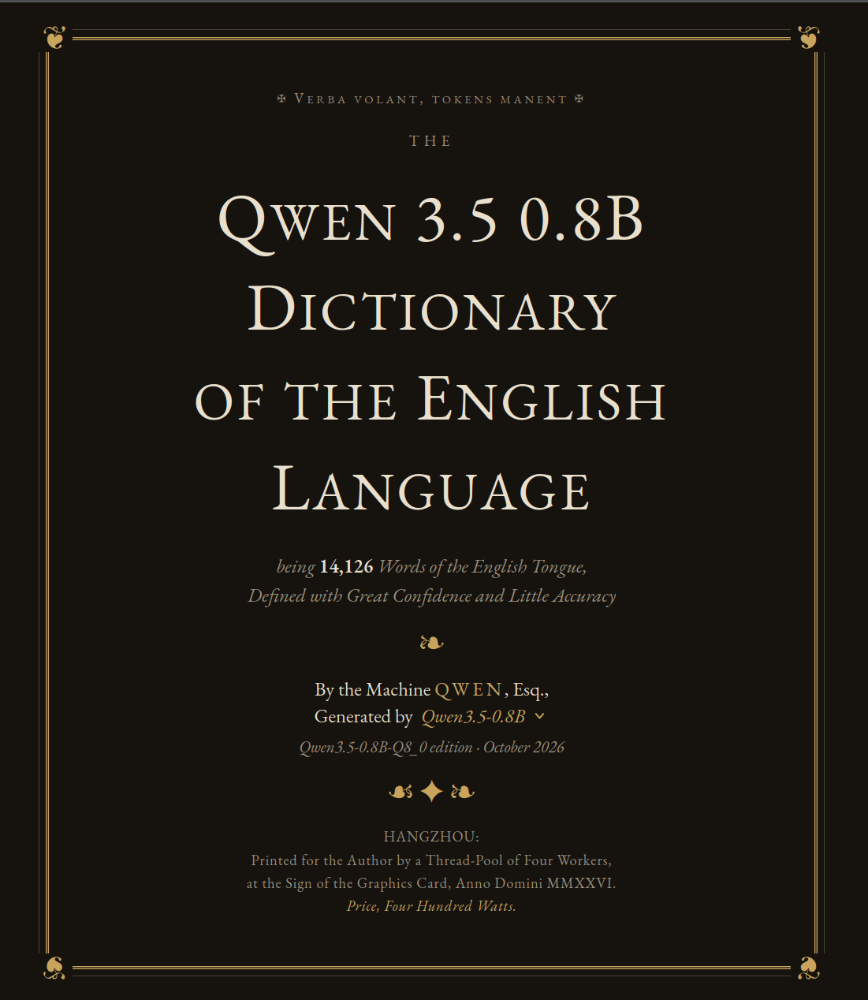

# The Qwen 3.5 0.8B Dictionary of the English Language

A tiny language model (Qwen 3.5 0.8B, running locally) wrote a dictionary entry for each of the 14,651 most common English words, and drew pictures for 125 of them.

**[Open the dictionary →](https://franciscocarloserra.github.io/qwen-dictionary/)**



```
python3 dictionary.py              # define every word in data/words.txt  -> data/definitions.jsonl
python3 dictionary.py illustrate   # draw the first 200 drawable words     -> data/illustrations/
python3 dictionary.py page         # refill the entries of index.html     -> index.html
```

Needs llama-server with Qwen on `localhost:6982`. Settings are at the top of `dictionary.py`. Word list: [FrequencyWords](https://github.com/hermitdave/FrequencyWords).
